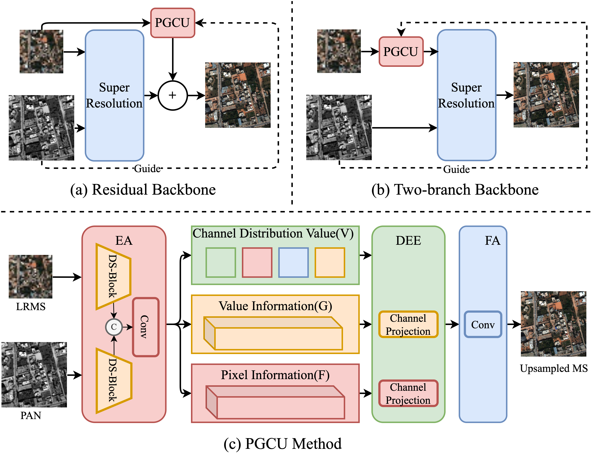
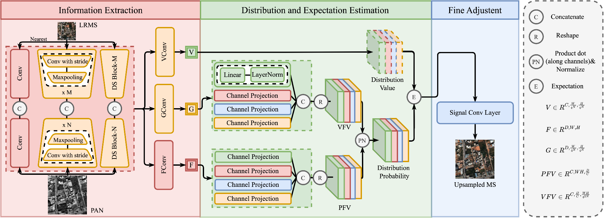

# Probability-based Global Cross-modal Upsampling for Pansharpening (CVPR'23)
[`Zeyu Zhu`](), and [`Xiangyong Cao`](https://gr.xjtu.edu.cn/en/web/caoxiangyong/home)

For more information please see our paper: [`Arxiv`](http://arxiv.org/abs/2303.13659)


## How PGCU can be embedded in existing method
<p align="center">
  
</p>
(a) PGCU module is embedded into the residual backbone; (b) PGCU module is embedded into the two-branch backbone; (c) The overall flow of PGCU module.

## Implementation of PGCU module 
<p align="center">
  
</p>
The PGCU module consists of three blocks, i.e., information extraction (IE), distribution and expectation estimation (DEE), and fine adjustment (FA). IE extracts global information of LRMS and cross-modal information of PAN. Then DEE estimates pixel expectation in the upsampled image. Finally, FA further compensates for using the local information and channel correlation of the upsampled image.

## Setting up a virtual conda environment
Setup a virtual conda environment using the provided ``requirements.txt``.
```
conda create --name PGCU --file requirements.txt
conda activate PGCU
```

## Embedding PGCU in your super-resolution model
You can samply define PGCU module in your model with three hyper-parameters, i.e., Channel, VecLen, NumberBlocks, which represent image channel, feature vector length and the number of stacked DSBlocks. Details can be found in our paper.
```
self.upsample = PGCU(Channel, VecLen, NumberBlocks)
```
In the forward funcation in your model, you can samply upsample the image with the guiding image, by following code,
```
# lrms: low resolution multispectral image
# pan: panchromatic (PAN) image
self.upsample.forward(lrms, pan)
```
It's worth noting that our implementation of PGCU is used to upsample LRMS to the scale of PAN while  PAN is four times the size of LRMS. So PGCU will upsample LRMS for four times. If you want to change it, you may add `MaxPooling` or `Conv2d` with `stride=2` to make the information matrix extracted from LRMS and PAN to be in the same size. The implementation of PGCU is in `model/PGCU.py`

## Other Codes
Data preprocessing, dataloader and metrics(SAM, ESGAR, PSNR and etc) are implemented in `utils`.

## Result on PanNet
Pre-trained models on WorldView2 and WorldView3 datasets are saved in `result/PanNet/WV2exp0` and `result/PanNet/WV3exp0`, respectively.
